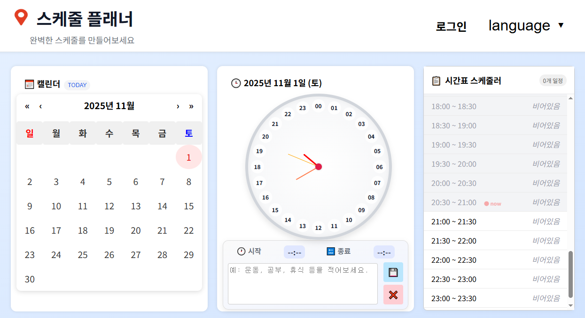

# 🗓️ Scheduling Frontend
[👉 메인 페이지 바로가기](https://jeonghyeon0329.github.io/scheduling_frontend/#/main)

[](https://jeonghyeon0329.github.io/scheduling_frontend/#/main)

---

## 📦 요구 사항
- Node.js v22.16.0  
- npm v10.9.2

## 🛠 설치 방법
```bash
# 1) 저장소 클론
git clone https://github.com/jeonghyeon0329/scheduling_frontend.git
cd scheduling_frontend

# 2) 의존성 설치
npm install

# 3) 개발 서버 실행
npm start

